# E-Commerce Web Application

## Project Description
This is a fully functional e-commerce web application built using Java EE and JSP, with a MySQL database. The application includes features such as product listing, product management, and a shopping cart system. It is designed with a user-friendly interface and efficient back-end services to provide a seamless shopping experience.

---

## Features
- **Home Page**: An overview of the site with featured products.
- **Product Management**: Admins can add, edit, and delete products.
- **Product Listing**: Customers can browse through the list of available products.
- **Cart System**: Add products to a cart and view the total price.
- **Responsive Design**: The application is optimized for both desktop and mobile devices.

---

## Technologies Used
- **Frontend**: JSP, HTML, CSS, Bootstrap
- **Backend**: Java EE, Servlets, JSP
- **Database**: MySQL
- **Web Server**: Apache Tomcat
- **Build Tool**: Maven

---

## Installation Guide
1. Clone the repository:
   ```bash
   git clone https://github.com/yourusername/ecommerce-app.git
   import the project into your IDE.
   ```
2. Set up the MySQL database:
3. Run the SQL scripts in the `database` folder to create the necessary tables and populate them with sample data.
4. Update the database configuration in the application.properties file:
   ```properties
   jdbc.url=jdbc:mysql://localhost:3306/ecommerce
   jdbc.username=username
   jdbc.password=password
   ```
5. Run the application on a web server (e.g., Apache Tomcat) and access it at `http://localhost:8080/ecommerce-app`.
6. You can log in as an admin with the following credentials:
   - **Username**: admin
   - **Password**: admin
   - Or as a customer
   - **Username**: customer
   - **Password**: customer
   - Or you can create a new account.
   - Enjoy shopping!
   - You can also access the admin panel at `http://localhost:8080/ecommerce-app/admin`.
   - You can manage products, categories, and orders from the admin panel.
   - You can also view the list of registered users and their details.
   - You can log out from the admin panel and log in as a customer to place an order.
   - You can view your order history and update your profile information.
   - You can also log out from the customer account and log in as an admin again.
   - Enjoy using the e-commerce web application!
   - Thank you for using our application!
   - If you have any questions or feedback, please contact us at
   - [email protected]himanthagamachchige@gmail.com
---
##Screenshots
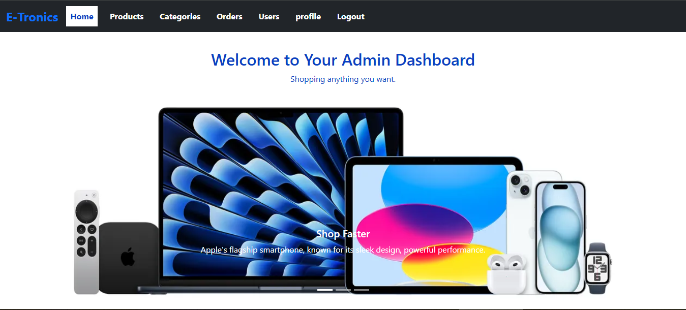
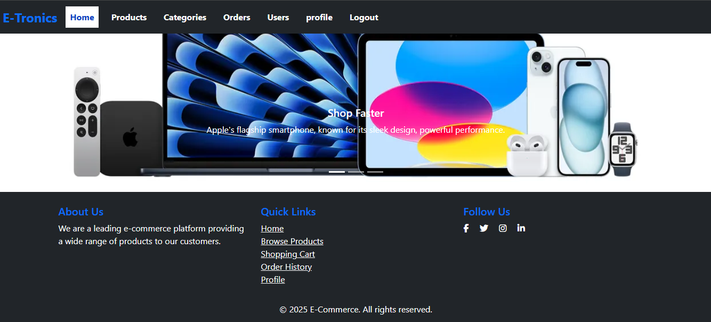
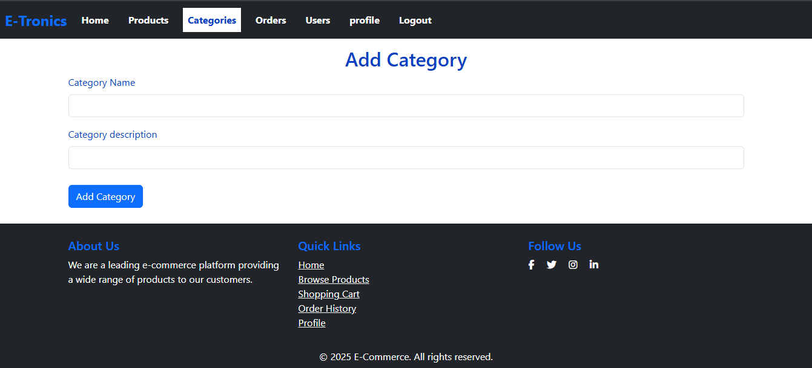
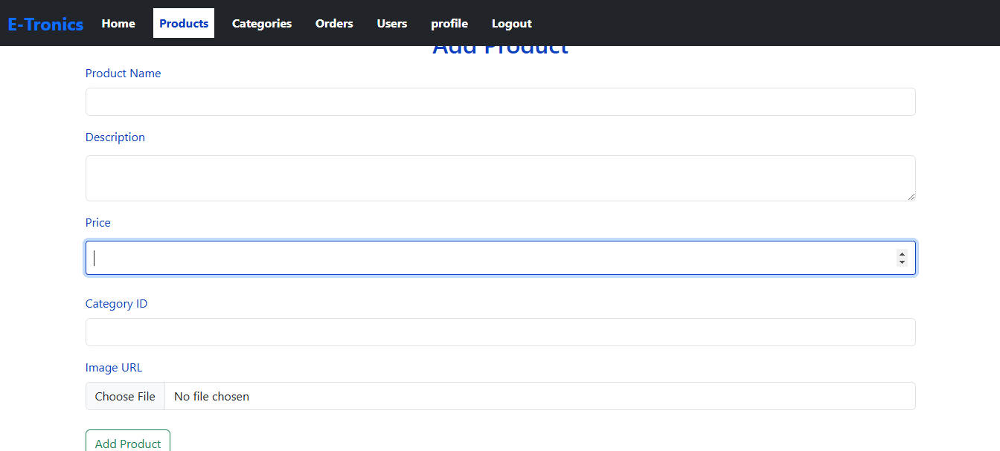
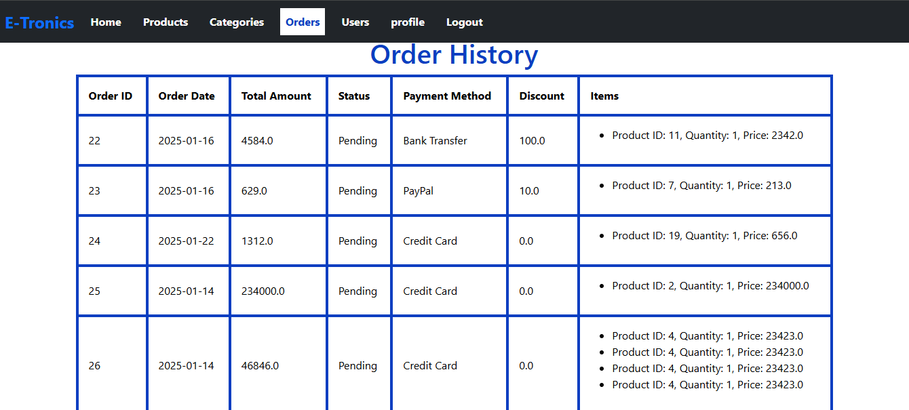
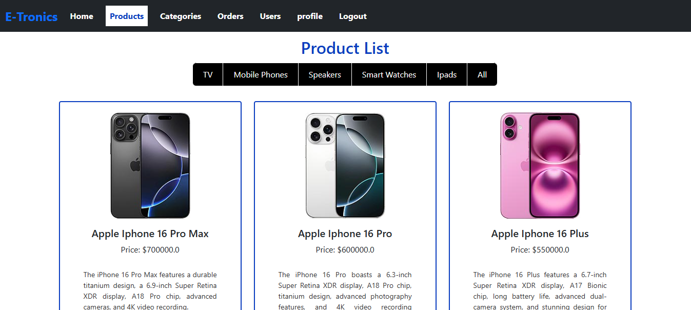
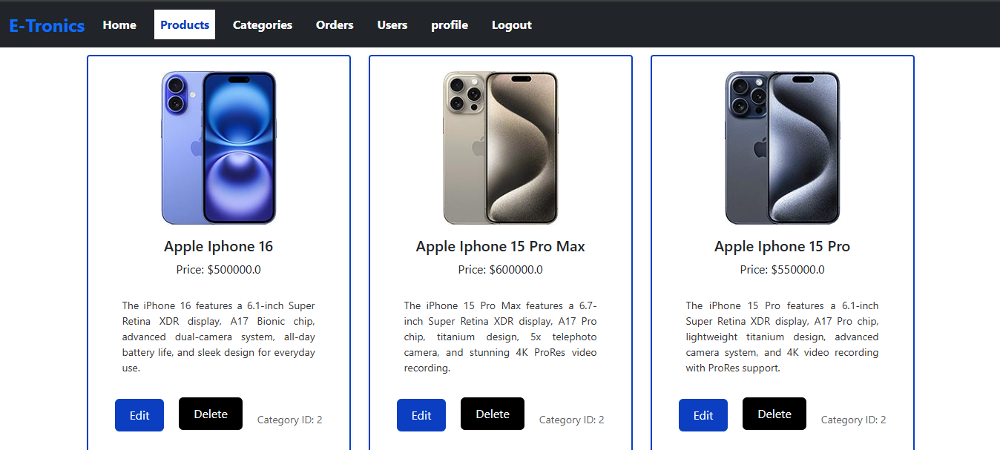
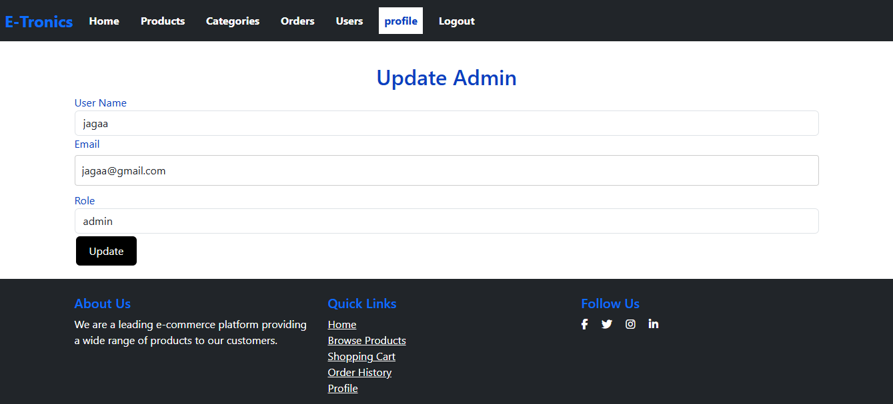
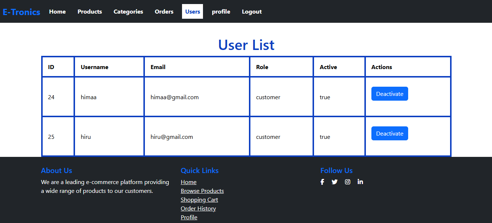
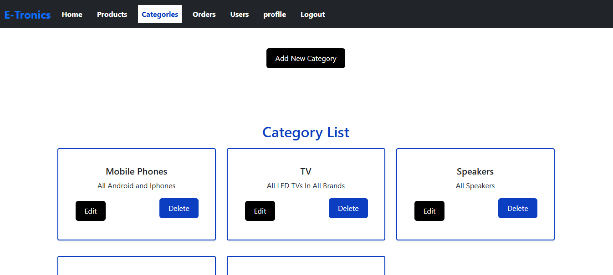
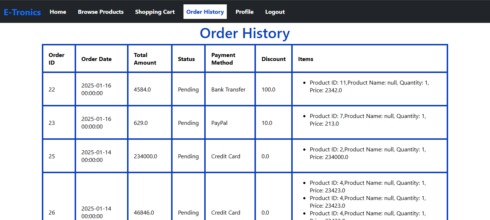
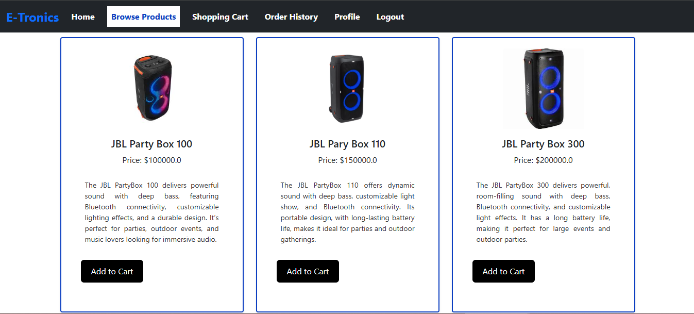
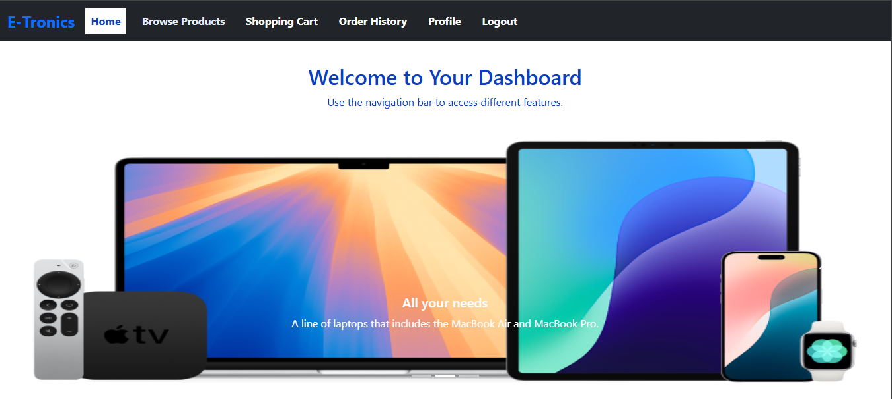
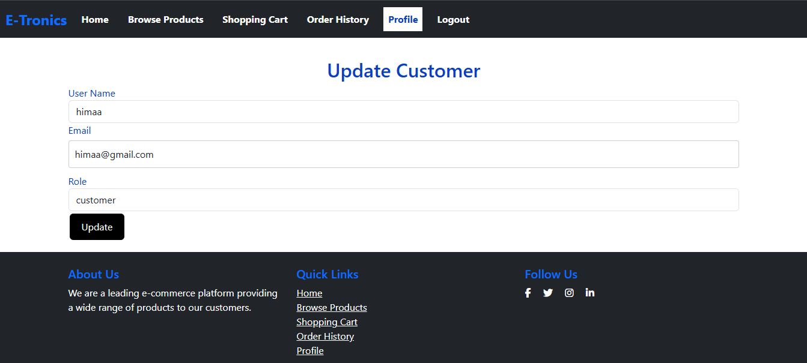
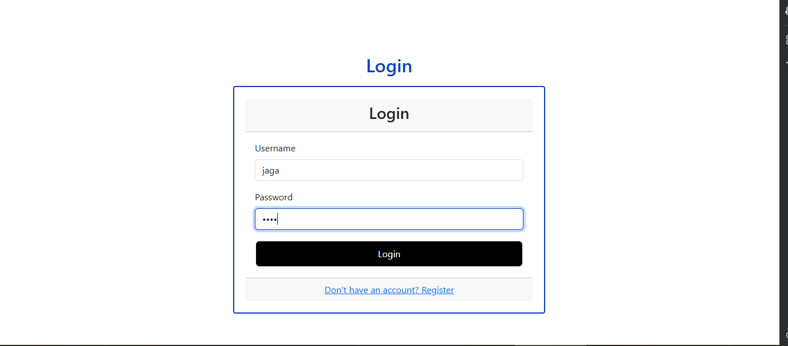
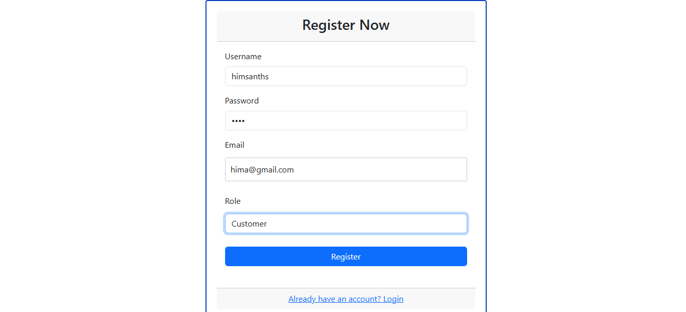
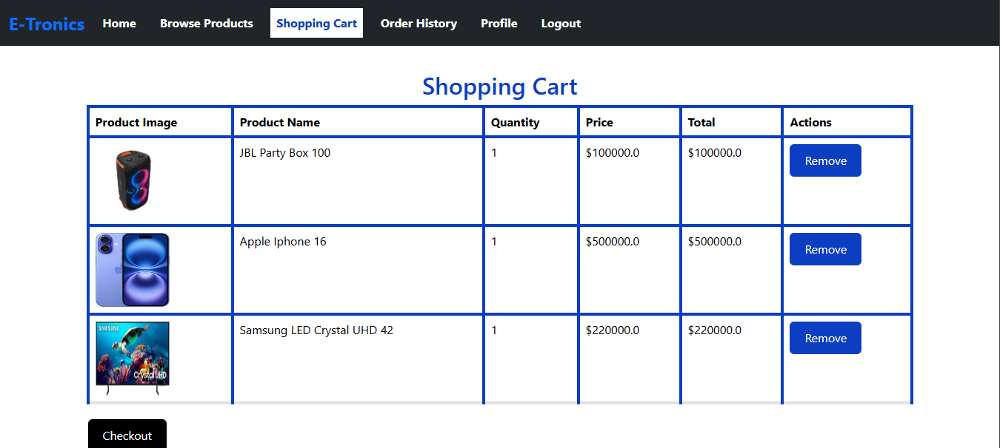


---
##Demo Video
[](https://www.youtube.com/watch?v=3QX2ZvJ1Z1A)

---
##Future enhancements
- **Payment Gateway Integration**: Add support for online payments using payment gateways like PayPal, Stripe, etc.
- **User Reviews and Ratings**: Allow customers to leave reviews and ratings for products.
- **Search Functionality**: Implement a search feature to help users find products quickly.
- **Wishlist Feature**: Allow customers to add products to a wishlist for future purchase.
- **Order Tracking**: Provide real-time order tracking for customers to monitor their orders.
- **Email Notifications**: Send email notifications for order confirmation, shipping updates, etc.
- **Social Media Integration**: Add social media sharing buttons to promote products on social platforms.
---
##Contributors
- **Himantha Gamachchige**